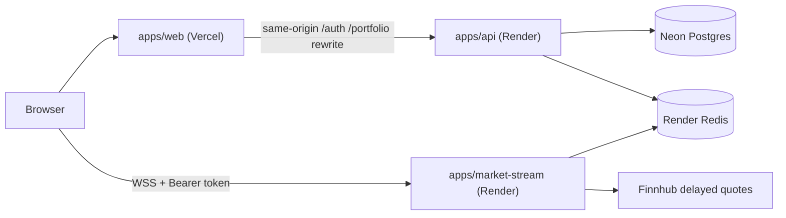

# CapitalFlow

Educational investment simulator (portfolio project). **No real money** is
held, transferred, or invested — every balance and trade is simulated.

> **Live demo:** _(set after Vercel deploy — replace this line with your
> production URL)_  
> **API health:** `https://capitalflow-api.onrender.com/health`  
> **Stream health:** `https://capitalflow-stream.onrender.com/health`

## Quick start (local)

```bash
# Node 22 (see .nvmrc)
pnpm install
pnpm docker:up          # Postgres + Redis
cp apps/api/.env.example apps/api/.env
cp apps/market-stream/.env.example apps/market-stream/.env
# Fill JWT keys + FINNHUB_API_KEY — see .env.example at repo root
pnpm --filter api exec prisma migrate deploy
pnpm dev                # web :3000, api :3001, market-stream :3002
```

## Architecture



## How to demo (reviewers)

1. Open the live URL — landing states this is an educational simulator.
2. Register → redirected to `/app/market` (badge **Simulator mode** in nav).
3. If Render was asleep, a banner says “The service is waking up… (~30s)”.
4. Portfolio starts at **$10,000.00** simulated cash.
5. Invest a small amount in AAPL — portfolio updates.
6. Logout / login again — session restored via HttpOnly cookie.

### Password reset in production

There is **no real email**. `POST /auth/forgot-password` logs:

`[password-reset] user=<email> link=<url>`

in Render’s **capitalflow-api** logs. Copy the link from there to complete a
reset. Locally, the API also returns `resetLink` in the JSON body and the
UI shows it.

## Env vars (summary)

| Var | Where | Notes |
|-----|--------|--------|
| `DATABASE_URL` | Render api | Neon **pooled** URL + `sslmode=require` |
| `REDIS_URL` | Render api + stream | From Render Redis |
| `JWT_ACCESS_PRIVATE_KEY` | Render api | PEM with `\n` escapes |
| `JWT_ACCESS_PUBLIC_KEY` | Render api + stream | Same public key |
| `FINNHUB_API_KEY` | Render stream only | Never on api |
| `WEB_APP_ORIGIN` | Render both | Exact Vercel production URL |
| `API_UPSTREAM_URL` | Vercel (server) | Render api URL for rewrites |
| `NEXT_PUBLIC_API_URL` | Vercel | **Empty** in production |
| `NEXT_PUBLIC_MARKET_STREAM_URL` | Vercel | Render stream URL |

Full table and one-time cloud setup: [`infra/DEPLOY.md`](./infra/DEPLOY.md).

## Cold starts

Render free tier spins down after ~15 minutes idle. A GitHub Actions
keep-alive pings `/health` every 10 minutes. The web UI still shows a
non-blocking wake-up banner on the first 502/503/network error within 60s.

## Specs

Feature work follows Spec-Driven Development under `specs/`. See
[`CLAUDE.md`](./CLAUDE.md) for stack and conventions.
